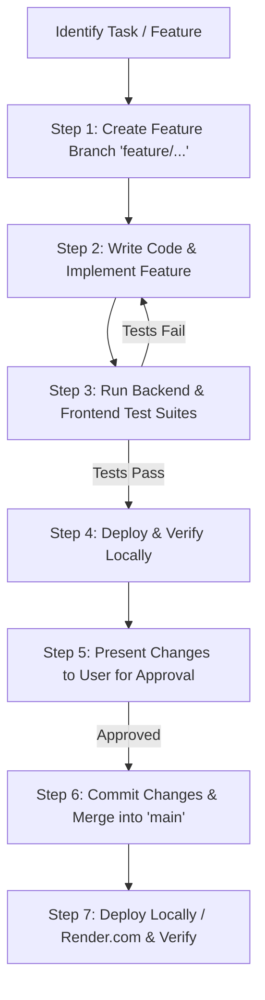
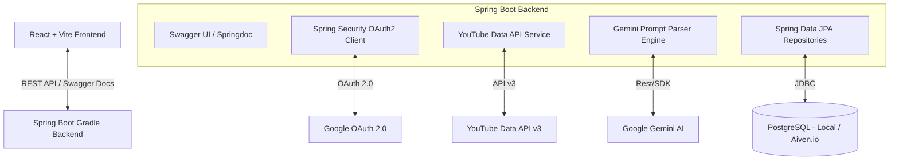

# Comprehensive Architecture & Implementation Plan: YouTube Subscriptions & AI Search Web App

---

## 1. Executive Summary

This document serves as the master blueprint for developing a full-stack Java (Spring Boot + Gradle) and React (Vite) web application. The application connects to YouTube via Google OAuth 2.0 to index, explore, stream, and query subscribed channels using AI-powered natural language prompt processing (Gemini API).

---

## 2. Updated Technology Stack

| Layer | Technology Choice | Details / Libraries |
| :--- | :--- | :--- |
| **Frontend Framework** | React 18 + Vite | Modern JavaScript/TypeScript, fast HMR, component-driven UI |
| **Frontend Testing** | Vitest + React Testing Library | Unit tests, component rendering tests, mock API tests |
| **Backend Framework** | Java 21 / Spring Boot 3.3+ | Spring Web, Spring Security OAuth2, Spring Data JPA |
| **Build Tool** | Gradle | Kotlin/Groovy DSL build scripts (`build.gradle`) |
| **API Documentation** | Swagger UI / OpenAPI 3 | `springdoc-openapi-starter-webmvc-ui` with comprehensive endpoint descriptions |
| **Backend Testing** | JUnit 5 + Mockito + Testcontainers | Controller, Service, and Repository integration tests |
| **Database (Local)** | PostgreSQL | Local instance (`localhost:5432/utube_db`) with Spring JPA & Flyway migrations |
| **Database (Cloud)** | Aiven.io PostgreSQL | Fully managed cloud database (switchable via Spring active profiles) |
| **Hosting Target** | Render.com | Unified web service or separated frontend static site + backend service |
| **Version Control** | GitHub | Feature-branch workflow, Git versioning, GitHub MCP server integration |

---

## 3. Strict Feature Branch & Git Lifecycle Rules

To maintain high code quality and zero regressions, **every single modification** will follow this strict lifecycle:



### Protocol Steps:
1. **Branch Creation**: Always git checkout a new branch (e.g. `feature/setup-gradle-vite`, `feature/oauth2-login`).
2. **Implementation**: Make necessary changes in isolated components/services.
3. **Automated Testing**:
   - Backend: `./gradlew test`
   - Frontend: `npm run test`
4. **Local Deployment Verification**: Start backend (`./gradlew bootRun`) & frontend (`npm run dev`), verify running app on `http://localhost:5173` / `http://localhost:8080`.
5. **User Approval**: Present test results and functional status to the user.
6. **Commit & Merge**: Commit with clean, structured commit messages and merge the feature branch into `main`.

---

## 4. Credentials & External Services Checklist

Here is the complete list of credentials and access permissions needed across development phases:

### A. Google Cloud & YouTube API Credentials (Required for Auth & Data)
- **Client ID**: `xxxxxxxx.apps.googleusercontent.com`
- **Client Secret**: `GOCSPX-xxxxxxxxxxxxxxxx`
- **Scopes**: `https://www.googleapis.com/auth/youtube.readonly`
- **Redirect URI**: `http://localhost:8080/login/oauth2/code/google`
- *(Optional)* **Gemini API Key**: From [Google AI Studio](https://aistudio.google.com/) for natural language prompt search.

### B. GitHub Repository Credentials (Required for Version Control)
- **Repository URL**: `https://github.com/<username>/<repo-name>.git`
- **GitHub Personal Access Token (PAT)** or **GitHub MCP Access**:
  - Scopes: `repo` (full control of private repositories).
  - Used for branch creation, committing, pushing, and merging.

### C. Aiven.io PostgreSQL Credentials (Required for Cloud Database Phase)
- **Host**: `xxxxxx.aivencloud.com`
- **Port**: `28972` (or designated port)
- **Database Name**: `utube_db`
- **Username**: `avrooot` / `db_user`
- **Password**: `xxxxxxxxxxxx`
- **SSL Certificate**: Aiven CA certificate / SSL mode `require`.

### D. Render.com Credentials (Required for Cloud Deployment Phase)
- **Render API Key / Account Connection**: For continuous deployment of backend JAR and frontend build.

---

## 5. System Architecture & Component Design



---

## 6. Swagger UI & OpenAPI Specification

The backend will expose an interactive **Swagger UI** at `http://localhost:8080/swagger-ui.html`.

### API Endpoints Catalog:

| HTTP Method | Endpoint | Description |
| :--- | :--- | :--- |
| **GET** | `/api/v1/auth/user` | Fetch current authenticated user's profile and OAuth connection status |
| **GET** | `/api/v1/subscriptions` | List all subscribed channels (cached locally, paginated) |
| **POST** | `/api/v1/subscriptions/sync` | Force incremental sync of subscriptions from YouTube Data API |
| **GET** | `/api/v1/channels/{id}/videos` | Retrieve recent uploads for a specific channel |
| **GET** | `/api/v1/channels/{id}/shorts` | Retrieve filtered Shorts videos (< 60s) for a channel |
| **GET** | `/api/v1/channels/{id}/playlists` | Retrieve public playlists owned by a channel |
| **POST** | `/api/v1/search/prompt` | Execute natural language prompt search parsed by Gemini AI |

---

## 7. Database Schema Design (PostgreSQL)

```sql
-- Subscriptions & Channels Table
CREATE TABLE channels (
    channel_id VARCHAR(255) PRIMARY KEY,
    title VARCHAR(255) NOT NULL,
    description TEXT,
    thumbnail_url VARCHAR(1024),
    subscriber_count BIGINT,
    video_count BIGINT,
    uploads_playlist_id VARCHAR(255),
    last_synced_at TIMESTAMP WITH TIME ZONE
);

-- Videos & Shorts Table
CREATE TABLE videos (
    video_id VARCHAR(255) PRIMARY KEY,
    channel_id VARCHAR(255) REFERENCES channels(channel_id),
    title VARCHAR(512) NOT NULL,
    description TEXT,
    thumbnail_url VARCHAR(1024),
    duration_seconds INT,
    is_short BOOLEAN DEFAULT FALSE,
    published_at TIMESTAMP WITH TIME ZONE,
    view_count BIGINT,
    like_count BIGINT
);

-- Playlists Table
CREATE TABLE playlists (
    playlist_id VARCHAR(255) PRIMARY KEY,
    channel_id VARCHAR(255) REFERENCES channels(channel_id),
    title VARCHAR(512) NOT NULL,
    description TEXT,
    item_count INT,
    thumbnail_url VARCHAR(1024)
);
```

---

## 8. GitHub Repository Setup Instructions

To sync this project with GitHub using Git CLI or GitHub MCP:

1. **Create GitHub Repository**:
   - Go to [GitHub New Repository](https://github.com/new).
   - Name: `utubehub`
   - Visibility: Public or Private.
   - Do NOT initialize with README (we will push our local repo).

2. **Connect Local Repo to Remote**:
   ```bash
   git init
   git remote add origin https://github.com/<your-username>/utubehub.git
   git branch -M main
   git push -u origin main
   ```

3. **Using GitHub MCP**:
   - We can create, push, open PRs, and merge directly using GitHub MCP tools.

---

## 9. Phased Implementation Roadmap

- **Phase 1**: Project Initialization & Environment Setup
  - Initialize Git repo on `main`.
  - Create `feature/project-scaffolding` branch.
  - Setup Spring Boot 3 Gradle backend & Vite React frontend.
  - Setup Local PostgreSQL database connection & Swagger UI.
  - Run backend (`./gradlew test`) & frontend (`npm run test`) test suites.
- **Phase 2**: OAuth2 & YouTube Data Ingestion
  - Google OAuth2 authentication flow.
  - Subscriptions fetcher & channel metadata indexer.
- **Phase 3**: Content Explorer & In-Browser Player
  - Channel deep-dive (Videos, Shorts, Playlists).
  - React YouTube player integration.
- **Phase 4**: Gemini AI Prompt-Based Search Engine
  - Prompt refinement service and hybrid local PostgreSQL + API search.
- **Phase 5**: Cloud Migration (Aiven.io PostgreSQL & Render.com Deployment)
  - Configure Aiven.io database profile and deploy service to Render.com.
